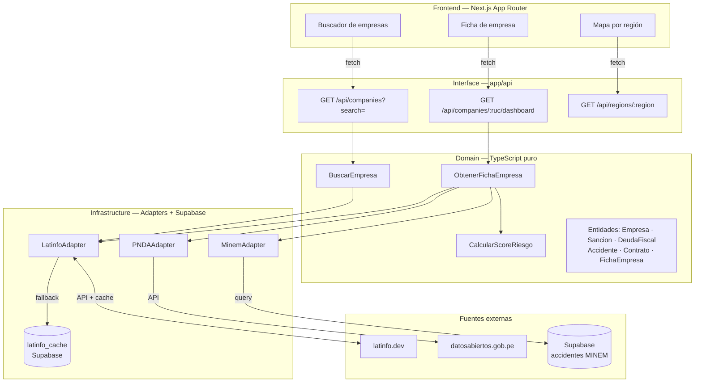
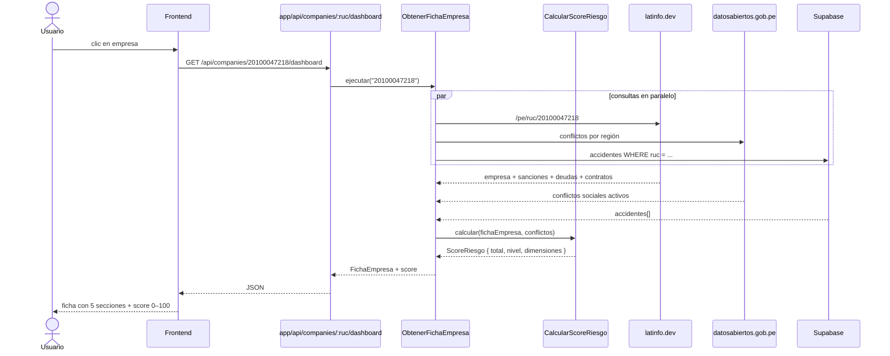
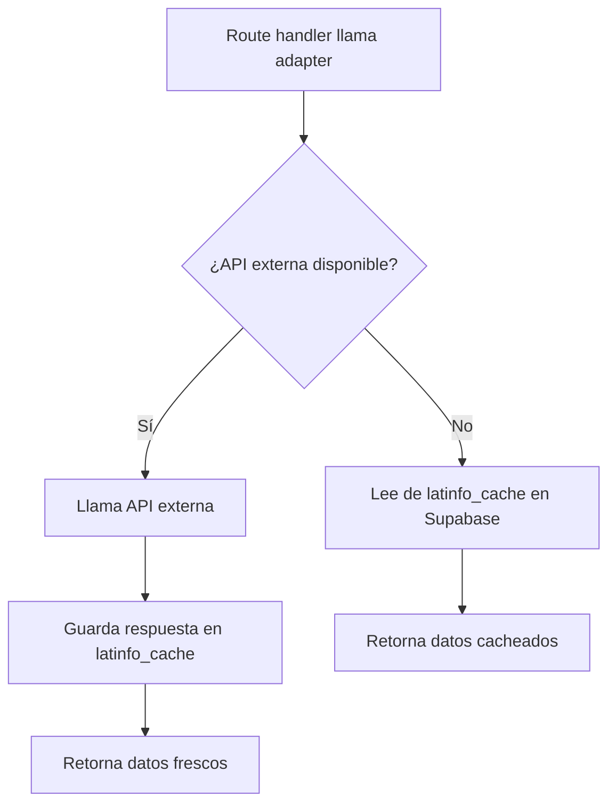

# Arquitectura del sistema — MineraWatch

## Capas del sistema



---

## Regla de dependencias

```
domain/         → NO importa nada de Next.js ni Supabase. TypeScript puro.
infrastructure/ → Implementa interfaces del domain. Puede importar Supabase y SDKs externos.
app/api/        → Llama casos de uso del domain. Nunca toca Supabase directo.
app/ (frontend) → Solo consume la API HTTP. Nunca llama al domain ni a Supabase.
```

---

## Flujo de datos — UC-02 Ver ficha de empresa



---

## Patrón Adapter + Cache + Fallback

Cada adapter de fuente externa sigue este flujo para que la demo funcione aunque la API esté caída:



---

## Estructura de carpetas

```
codigo/
├── app/
│   ├── api/
│   │   ├── companies/
│   │   │   ├── route.ts              ← GET /api/companies?search=
│   │   │   └── [ruc]/
│   │   │       └── dashboard/
│   │   │           └── route.ts      ← GET /api/companies/:ruc/dashboard
│   │   └── regions/
│   │       └── [region]/
│   │           └── route.ts          ← GET /api/regions/:region
│   └── (páginas y componentes)
├── domain/
│   ├── entities/
│   │   ├── empresa.ts
│   │   ├── sancion.ts
│   │   ├── deuda-fiscal.ts
│   │   ├── accidente.ts
│   │   ├── contrato.ts
│   │   └── ficha-empresa.ts
│   ├── repositories/
│   │   ├── IEmpresaRepository.ts
│   │   ├── ISancionRepository.ts
│   │   ├── IDeudaRepository.ts
│   │   ├── IAccidenteRepository.ts
│   │   └── IContratoRepository.ts
│   └── use-cases/
│       ├── BuscarEmpresa.ts
│       ├── ObtenerFichaEmpresa.ts
│       └── CalcularScoreRiesgo.ts
└── infrastructure/
    ├── repositories/
    │   ├── LatinfoEmpresaRepository.ts
    │   ├── LatinfoSancionRepository.ts
    │   ├── LatinfoDeudaRepository.ts
    │   ├── LatinfoContratoRepository.ts
    │   └── SupabaseAccidenteRepository.ts
    └── database/
        └── supabase-client.ts
```
