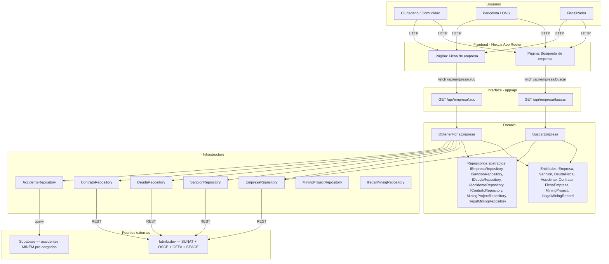
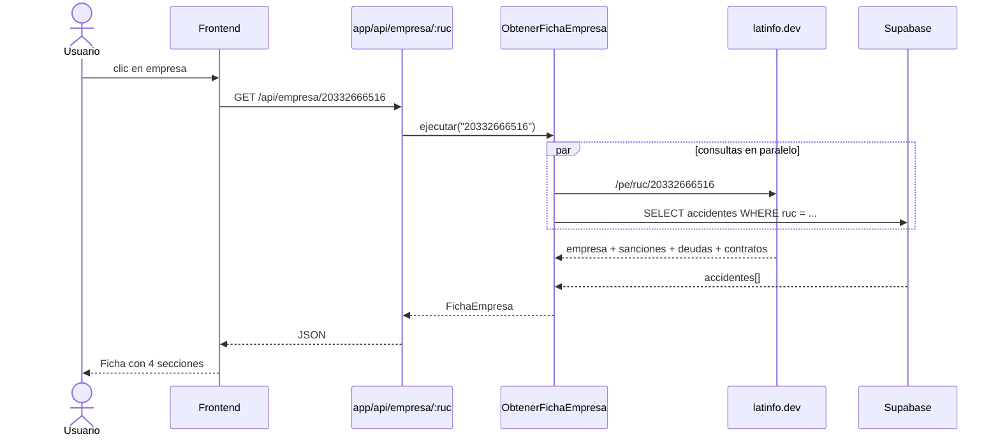

# Arquitectura del sistema — MineraWatch

## Diagrama de arquitectura

## Capas

| Capa | Carpeta | Responsabilidad |
|---|---|---|
| Domain | `domain/` | Entidades, casos de uso, repositorios abstractos. TypeScript puro — sin Next.js ni Supabase |
| Infrastructure | `infrastructure/` | Implementaciones concretas: latinfo.dev client, Supabase client |
| Interface | `app/api/` | Route handlers HTTP que orquestan los casos de uso |
| Frontend | `app/` (fuera de api/) | Páginas y componentes React. Solo consume la API por HTTP |

## Flujo de datos — UC-03 ObtenerFichaEmpresa

