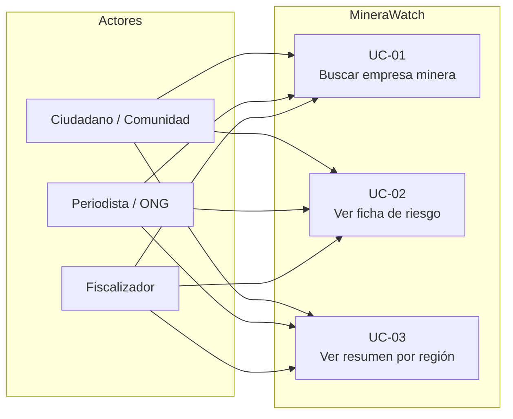

# Requerimientos — MineraWatch

## Casos de uso

### UC-01 — Buscar empresa minera

| Campo | Detalle |
|---|---|
| Actor | Cualquier usuario |
| Entrada | Nombre o RUC (mínimo 3 caracteres) |
| Proceso | Consulta latinfo.dev `/pe/sunat/padron/search` |
| Salida | Lista de empresas con nombre, RUC y región |
| Error | 400 si el texto tiene menos de 3 caracteres |

### UC-02 — Ver ficha de riesgo

| Campo | Detalle |
|---|---|
| Actor | Cualquier usuario |
| Entrada | RUC de 11 dígitos |
| Proceso | Consulta en paralelo: latinfo.dev (sanciones, deudas, contratos) + Supabase (accidentes MINEM) + PNDA (conflictos) |
| Salida | Ficha con 5 secciones + score de riesgo 0–100 |
| Regla | Si una fuente falla, las demás siguen respondiendo |

### UC-03 — Ver resumen por región

| Campo | Detalle |
|---|---|
| Actor | Cualquier usuario |
| Entrada | Nombre de región (ej. "La Libertad") |
| Proceso | Devuelve empresas, conflictos y obras públicas de esa región |
| Salida | Lista de empresas con nivel de riesgo + conflictos activos + proyectos públicos |

---

## Requisitos funcionales

| ID | Requisito |
|---|---|
| RF-01 | El sistema permite buscar empresas mineras por nombre o RUC (mínimo 3 caracteres) |
| RF-02 | La ficha de empresa muestra 5 secciones: seguridad, medio ambiente, legal/fiscal, conflicto social, inversión pública |
| RF-03 | El sistema calcula un score de riesgo (0–100) combinando seguridad (40%), legalidad (35%) e impacto social (25%) |
| RF-04 | Si una fuente de datos falla, las demás secciones de la ficha siguen respondiendo |
| RF-05 | Las sanciones OEFA solo suman al score si su estado es **firme** (no apelada ni impugnada) |
| RF-06 | El sistema muestra un resumen territorial por región con empresas, conflictos y obras públicas |
| RF-07 | Las respuestas de APIs externas se cachean en Supabase para garantizar disponibilidad |

---

## Requisitos no funcionales

| ID | Requisito |
|---|---|
| RNF-01 | **Disponibilidad:** la demo funciona aunque las APIs externas estén caídas (fallback a cache Supabase) |
| RNF-02 | **Rendimiento:** las consultas por empresa se ejecutan en paralelo — no en secuencia |
| RNF-03 | **Mantenibilidad:** el dominio (`domain/`) no importa nada de Next.js ni Supabase — TypeScript puro y testeable |
| RNF-04 | **Seguridad:** las API keys solo existen en el servidor, nunca llegan al navegador |
| RNF-05 | **Escalabilidad:** deploy serverless en Vercel — sin servidor que administrar |
